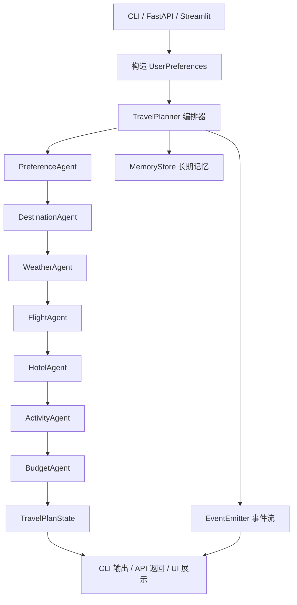

# Travel Planner 代码书

这是一个面向学习和面试表达的多 Agent 旅行规划项目。
项目重点不是做一个花哨 Demo，而是把真实 API、Agent 编排、流式输出、长短期记忆和可维护的代码结构放进一个能跑通的雏形里。

## 1. 项目目标

- 使用 `Qwen` 做推理和结构化整理
- 使用 `Tavily` 做联网检索
- 使用 `wttr.in` 查询真实天气
- 用多 Agent 方式生成一份可阅读的旅行方案
- 保留流式输出、会话状态、长期偏好记忆这些后续可扩展能力

## 2. 架构图

### 2.1 主流程图



### 2.2 分层图

```text
输入层
├─ main.py
├─ api/app.py
└─ ui/streamlit_app.py

编排层
└─ orchestrator/pipeline.py

Agent 层
└─ agents/*.py

能力层
├─ services/qwen_client.py
├─ services/tavily_client.py
├─ services/weather_client.py
├─ services/memory_store.py
└─ services/preferences.py

提示词层
└─ prompts/planner_prompts.py

数据模型层
└─ models/schemas.py
```

## 3. 技术栈

- Python
- FastAPI
- Streamlit
- Pydantic
- LangChain
- Qwen
- Tavily
- wttr.in

## 4. 快速运行

### 4.1 安装依赖

```bash
pip install -r requirements.txt
```

### 4.2 配置环境变量

在项目根目录创建 `.env`：

```env
QWEN_API_KEY=你的真实Qwen密钥
QWEN_BASE_URL=https://dashscope.aliyuncs.com/compatible-mode/v1
QWEN_MODEL=qwen-plus
TAVILY_API_KEY=你的真实Tavily密钥
ENABLE_LONG_TERM_MEMORY=true
MEMORY_DIR=memories
```

### 4.3 运行命令行版本

```bash
python main.py --departure Shanghai --style comfort --budget 12000 --interests food culture
```

### 4.4 启动 FastAPI

```bash
uvicorn api.app:app --reload
```

### 4.5 启动 Streamlit

```bash
streamlit run ui/streamlit_app.py
```

## 5. 运行截图

> 截图占位 1：CLI 输出结果
>
> 截图占位 2：FastAPI `/docs` 页面
>
> 截图占位 3：Streamlit 实时事件流界面

你后续可以把真实截图放到 `assets/` 目录，再在这里替换成图片链接。

## 6. 演示视频

> 视频链接占位 1：项目整体演示
>
> 视频链接占位 2：流式输出演示
>
> 视频链接占位 3：记忆读写演示

## 7. API 接口

### 7.1 健康检查

```http
GET /api/health
```

### 7.2 一次性返回最终方案

```http
POST /api/plan
```

### 7.3 返回完整状态

```http
POST /api/plan/full
```

### 7.4 流式返回规划事件

```http
POST /api/plan/stream
```

## 8. 代码书

这一部分按“读代码”的顺序介绍每个核心文件是做什么的。

### 8.1 入口层

- `main.py`
  - 命令行入口
  - 负责解析参数、构造用户偏好、调用编排器、打印结果
- `api/app.py`
  - FastAPI 入口
  - 提供普通接口和 SSE 流式接口
- `ui/streamlit_app.py`
  - Streamlit 页面
  - 负责收集输入、展示事件流和最终旅行方案

### 8.2 编排层

- `orchestrator/pipeline.py`
  - 项目的主脑
  - 负责按顺序调用各个 Agent
  - 负责把运行时依赖、事件流、记忆读写串起来

### 8.3 Agent 层

- `agents/base_agent.py`
  - 所有 Agent 的基类
  - 统一处理名字、事件发射、执行入口
- `agents/preference_agent.py`
  - 读取用户输入
  - 结合长期记忆补齐本次偏好上下文
- `agents/destination_agent.py`
  - 调 Tavily 搜索候选目的地
  - 调 Qwen 把搜索结果整理成结构化目的地建议
- `agents/weather_agent.py`
  - 根据目的地调用 `wttr.in`
  - 把天气写入全局状态
- `agents/flight_agent.py`
  - 生成交通方案建议
  - 当前是“真实搜索 + 大模型整理”，不是票务直连
- `agents/hotel_agent.py`
  - 生成住宿建议
  - 当前是“真实搜索 + 大模型整理”，不是酒店库存直连
- `agents/activity_agent.py`
  - 搜索景点、美食、文化体验
  - 生成按天安排行程
- `agents/budget_agent.py`
  - 汇总交通、酒店、活动开销
  - 判断是否超预算，并给出压缩建议

### 8.4 服务层

- `services/qwen_client.py`
  - Qwen 调用封装
  - 使用 LangChain 风格的 `prompt | llm | parser`
  - 支持普通调用、JSON 输出、流式输出
- `services/tavily_client.py`
  - Tavily 搜索封装
  - 负责发请求并整理搜索结果
- `services/weather_client.py`
  - 天气查询封装
  - 使用 `wttr.in` 返回真实天气信息
- `services/memory_store.py`
  - 长期记忆存储
  - 把用户偏好摘要写到本地 JSONL
- `services/preferences.py`
  - 输入归一化
  - 把 CLI/API/UI 的输入统一转成 `UserPreferences`

### 8.5 模型层

- `models/schemas.py`
  - 所有共享数据结构都在这里
  - 包括用户偏好、事件、天气、住宿、交通、活动、总状态等

### 8.6 提示词层

- `prompts/planner_prompts.py`
  - 所有 Agent 的中文提示词模板
  - 使用 `ChatPromptTemplate` 和 `MessagesPlaceholder`
  - 负责约束模型输出结构

### 8.7 测试层

- `tests/test_pipeline.py`
  - 主流程测试
  - 检查编排是否按预期运行
- `tests/test_preferences.py`
  - 输入标准化测试
- `tests/test_memory.py`
  - 长期记忆读写测试

## 9. 推荐阅读顺序

如果你要快速理解这个项目，建议按下面顺序看：

1. `models/schemas.py`
2. `services/preferences.py`
3. `orchestrator/pipeline.py`
4. `agents/base_agent.py`
5. `agents/preference_agent.py`
6. `agents/destination_agent.py`
7. `agents/weather_agent.py`
8. `agents/flight_agent.py`
9. `agents/hotel_agent.py`
10. `agents/activity_agent.py`
11. `agents/budget_agent.py`
12. `services/qwen_client.py`
13. `services/tavily_client.py`
14. `services/weather_client.py`
15. `api/app.py`
16. `ui/streamlit_app.py`

## 10. 当前项目边界

这个项目当前是一个“真实查询 + LLM 规划”的 Agent 雏形，不是完整商用旅行平台。

当前没有做的部分：

- 没有直连机票实时库存 API
- 没有直连酒店可订房 API
- 没有支付、登录、订单系统
- 没有数据库版长期记忆
- 没有向量检索

这不是缺陷，而是当前阶段的刻意收敛。
这样更适合学习多 Agent 架构、工具调用和系统设计表达。

## 11. 后续优化方向

- 接入真实航班 API，如 Amadeus
- 接入真实酒店 API
- 长期记忆从本地 JSONL 升级到 SQLite 或向量库
- 用 LangGraph 重构状态流转
- 为 SSE 事件增加更细的阶段状态
- 为 Qwen 输出增加更强的结构化校验和重试策略

## 12. 一句话总结

这是一个以真实 API 为基础、以多 Agent 编排为核心、适合作为学习项目和面试项目讲解的旅行规划系统雏形。
