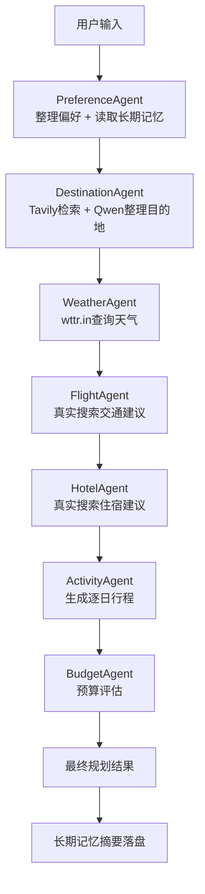

# Travel Planner 代码书

这是一个以真实搜索为基础的旅行规划 Agent 项目。

它把 `Tavily + Qwen + wttr.in + FastAPI + Streamlit + LangChain + 长短期记忆` 串成了一条完整的旅行规划链路，适合你一边练手、一边讲项目架构。

---

## 1. 项目目标

用户输入：

- 出发地
- 预算
- 出行日期
- 旅行风格
- 兴趣标签

系统会自动完成：

1. 整理偏好
2. 读取历史记忆
3. 搜索目的地
4. 查询天气
5. 搜索交通建议
6. 搜索酒店建议
7. 生成按天行程
8. 汇总预算建议

---

## 2. 架构图

### 2.1 总体架构图



### 2.2 代码分层图

```text
main.py
  └─ orchestrator/pipeline.py
      ├─ agents/
      ├─ services/
      ├─ prompts/
      └─ models/

api/app.py
  └─ 复用同一套 TravelPlanner

ui/streamlit_app.py
  └─ 复用同一套 TravelPlanner 和事件流
```

---

## 3. 技术栈

- `FastAPI`：接口层
- `Streamlit`：交互界面
- `LangChain Core`：提示词、消息、链式调用
- `langchain-openai`：通过 OpenAI 兼容方式调用 Qwen
- `Tavily`：实时搜索
- `wttr.in`：实时天气
- `Pydantic`：统一数据模型
- `pytest`：测试

---

## 4. 快速运行

### 4.1 安装依赖

```bash
pip install -r requirements.txt
```

### 4.2 配置环境变量

复制模板：

```bash
copy .env.example .env
```

至少填写：

```env
QWEN_API_KEY=你的真实Qwen密钥
QWEN_BASE_URL=https://dashscope.aliyuncs.com/compatible-mode/v1
QWEN_MODEL=qwen-plus
TAVILY_API_KEY=你的真实Tavily密钥
```

### 4.3 运行 CLI

```bash
python main.py --departure Shanghai --style comfort --budget 12000 --interests food culture
```

### 4.4 运行 API

```bash
python -m api.app
```

### 4.5 运行前端

```bash
streamlit run ui/streamlit_app.py
```

### 4.6 运行测试

```bash
pytest -q
```

---

## 5. 运行截图占位

这一节先给占位，后续你可以把真实截图补进来。

### 5.1 CLI 运行截图占位

```text
[待补] docs/images/cli-demo.png
```

### 5.2 FastAPI 接口截图占位

```text
[待补] docs/images/api-demo.png
```

### 5.3 Streamlit 页面截图占位

```text
[待补] docs/images/streamlit-demo.png
```

---

## 6. 视频链接占位

这一节也是占位，后续你可以换成 B 站、YouTube 或网盘链接。

- 项目演示视频：`待补`
- 架构讲解视频：`待补`
- 面试讲稿配套视频：`待补`

---

## 7. API 接口说明

- `GET /api/health`
- `POST /api/plan`
- `POST /api/plan/full`
- `POST /api/plan/stream`

其中：

- `/api/plan` 返回压缩后的规划结果
- `/api/plan/full` 返回完整状态对象
- `/api/plan/stream` 返回 SSE 事件流

常见事件：

- `agent_started`
- `tool_called`
- `tool_result`
- `agent_completed`
- `state_updated`
- `final_plan`

---

## 8. 代码书

这一节是整份 README 的核心。

你可以把它当成项目代码地图。

### 8.1 根目录文件

| 文件 | 作用 |
|---|---|
| `main.py` | 命令行入口，负责读取参数、构建偏好、调用规划器、打印结果 |
| `.env.example` | 环境变量模板 |
| `requirements.txt` | 项目依赖 |
| `pytest.ini` | pytest 配置 |
| `README.md` | 当前这份代码书 |
| `README-python.md` | Python 版补充说明 |

### 8.2 `agents/`

这一层负责“真正做事”。

| 文件 | 作用 |
|---|---|
| `agents/base_agent.py` | 所有 Agent 的统一基类，负责统一执行模板和事件上报 |
| `agents/preference_agent.py` | 整理用户偏好、补默认兴趣、加载长期记忆 |
| `agents/destination_agent.py` | 搜索候选目的地，并让 Qwen 输出结构化推荐 |
| `agents/weather_agent.py` | 查询目的地天气 |
| `agents/flight_agent.py` | 生成交通建议 |
| `agents/hotel_agent.py` | 生成酒店建议 |
| `agents/activity_agent.py` | 生成逐日行程 |
| `agents/budget_agent.py` | 汇总成本并判断预算是否可行 |

### 8.3 `services/`

这一层负责“连外部能力”。

| 文件 | 作用 |
|---|---|
| `services/preferences.py` | 统一构建 `UserPreferences` |
| `services/event_stream.py` | 统一事件流格式 |
| `services/runtime.py` | 把 Tavily、Qwen、天气、记忆等依赖打包传给 Agent |
| `services/qwen_client.py` | 用 LangChain 链式方式调用 Qwen |
| `services/tavily_client.py` | 真实搜索客户端 |
| `services/weather_client.py` | 天气查询客户端 |
| `services/memory_store.py` | 长期记忆 JSONL 读写 |

### 8.4 `models/`

这一层负责“统一数据结构”。

| 文件 | 作用 |
|---|---|
| `models/schemas.py` | 定义全局状态、事件、目的地、天气、酒店、活动、预算等模型 |

重点看：

- `UserPreferences`
- `TravelPlanState`
- `PlanningEvent`

### 8.5 `orchestrator/`

这一层负责“把步骤串起来”。

| 文件 | 作用 |
|---|---|
| `orchestrator/pipeline.py` | 主编排器，控制 Agent 执行顺序和事件流输出 |

### 8.6 `prompts/`

这一层负责“提示词模板”。

| 文件 | 作用 |
|---|---|
| `prompts/planner_prompts.py` | 目的地、交通、酒店、活动四类提示词模板 |

### 8.7 `api/`

这一层负责“把能力暴露给外部调用”。

| 文件 | 作用 |
|---|---|
| `api/app.py` | FastAPI 应用入口 |

### 8.8 `ui/`

这一层负责“把结果展示给用户”。

| 文件 | 作用 |
|---|---|
| `ui/streamlit_app.py` | Streamlit 界面，实时展示事件流和最终结果 |

### 8.9 `tests/`

这一层负责“保证结构没坏”。

| 文件 | 作用 |
|---|---|
| `tests/test_agents.py` | 用 fake client 做集成风格测试 |

---

## 9. 推荐阅读顺序

如果你想快速读懂这个项目，建议按这个顺序：

1. `README.md`
2. `main.py`
3. `orchestrator/pipeline.py`
4. `models/schemas.py`
5. `agents/base_agent.py`
6. `agents/preference_agent.py`
7. `agents/destination_agent.py`
8. `agents/weather_agent.py`
9. `agents/flight_agent.py`
10. `agents/hotel_agent.py`
11. `agents/activity_agent.py`
12. `agents/budget_agent.py`
13. `services/qwen_client.py`
14. `services/tavily_client.py`
15. `services/weather_client.py`
16. `services/memory_store.py`
17. `prompts/planner_prompts.py`
18. `api/app.py`
19. `ui/streamlit_app.py`
20. `tests/test_agents.py`

---

## 10. 当前项目边界

这个项目现在已经不是 mock 演示项目了，但也有边界：

- 天气：真实查询
- 搜索：真实查询
- 目的地/活动/酒店/交通建议：真实搜索 + Qwen 整理
- 酒店和交通：当前不是实时交易 API
- 记忆：当前是 JSONL，不是数据库或向量库

所以你在面试里可以这样说：

> 我现在先把真实检索、结构化生成、事件流和长短期记忆打通。  
> 后面如果继续往生产级走，会优先把交通和酒店抽成 provider，再接入更强的实时 API。

---

## 11. 后续优化方向

- 把交通和酒店拆成 provider 层
- 给 Qwen 输出加更严格的 JSON 校验
- 把长期记忆从 JSONL 升级到 SQLite 或向量库
- 给活动规划加天气敏感逻辑
- 加入多用户会话隔离
- 增加运行日志和调试面板

---

## 12. 一句话总结

这是一个以真实搜索为基础、以 Qwen 做结构化整合、以 LangChain 链式调用组织模型请求、以事件流驱动 API 和 UI、以 JSONL 做长期记忆的旅行规划 Agent 雏形。
